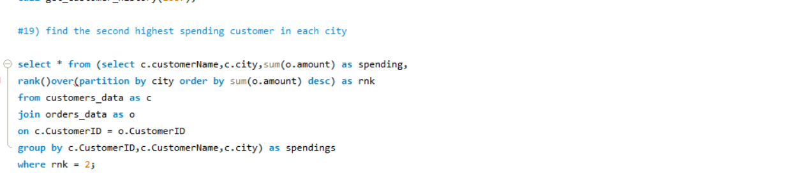
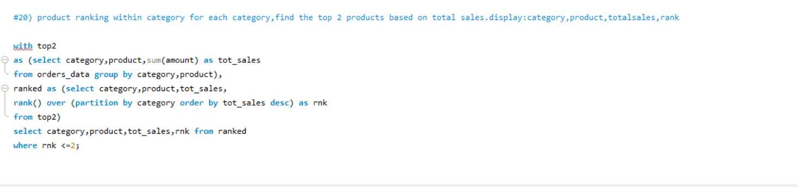
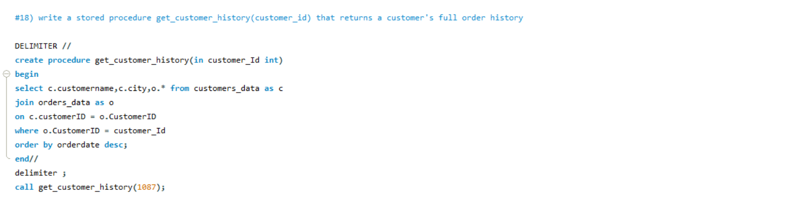

# E-Commerce Sales Analysis Using SQL

## 📌 Project Overview

This project analyzes e-commerce sales and customer data using SQL to discover meaningful business insights.

The analysis focuses on customer spending, product performance, category sales, order trends, and customer ranking.

**Raw Data → SQL Queries → Analysis → Business Insights**

---

## Dataset

This project contains two datasets:

### Orders
Contains order-level information such as:
- Order ID
- Customer ID
- Product
- Category
- Quantity
- Unit Price
- Amount
- Payment Method
- Order Date
- Order Status

### Customers
Contains customer information such as:
- Customer ID
- Customer Name
- City
- State
- Age

The two tables are connected using `CustomerID`.

---

## Business Questions

Some of the questions explored in this project:

- How many total orders are recorded?
- What are the available product categories?
- Which categories have the highest number of orders?
- What is the total sales amount?
- Which products generate the highest sales?
- Who are the highest-spending customers?
- Which cities generate the most customer spending?
- What are the monthly sales trends?
- Which payment methods are most commonly used?
- How are orders distributed by status?
- Who are the top 3 customers in each city?
- What are the top 2 products within each category?

---

##  SQL Skills Used

- SELECT
- WHERE
- ORDER BY
- GROUP BY
- DISTINCT
- Aggregate Functions
- JOINs
- Subqueries
- Common Table Expressions (CTEs)
- Window Functions
- RANK()
- DENSE_RANK()
- ROW_NUMBER()
- Views
- Stored Procedures

---

##  Advanced SQL Analysis

###  Top Customers

Identified the highest-spending customers using aggregation and table joins.

###  Customer Ranking by City

Used **CTEs and DENSE_RANK()** to identify the top 3 customers within each city.

###  Product Ranking

Used **Window Functions** to find the top 2 products within each category.

###  Sales Analysis

Analyzed sales performance by product, category, customer, and time period.

---

##  Project Screenshots

### Top Customers

### Product Ranking

### Stored Procedure

